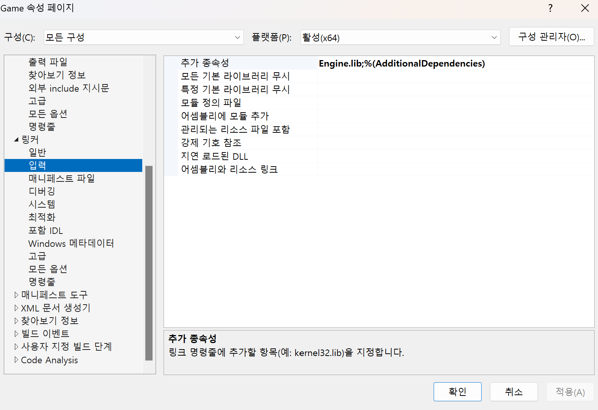
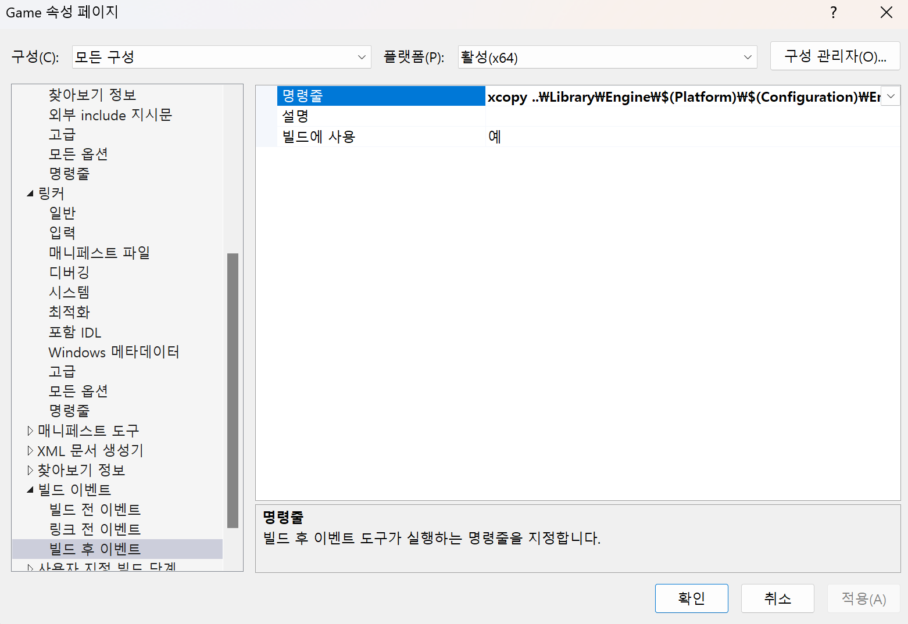

## 콘솔 엔진 제작
<details>
<summary><span style="font-size: 25px; font-weight: 700; color: blue">1) DLL 사용 하기</span></summary>

### 1) DLL을 만들 프로젝트에서 해줘야 할일
- 프로젝트 속성 -> 구성 속성 -> 일반 -> 구성 형식을 DLL로 변경한다.
- 헤더 파일들에는 __declspec(dllexport) 키워드를 붙여줘야 한다.
- 헤더 파일과 DLL, LIB을 EXE 쪽에서 사용 해야함으로 해당 파일들을 특정 경로에 저장한다.
- 저장을 편하게 하기 위해 빌드 전, 후 이벤트를 이용해 명령을 넣어준다.
  - 빌드 전 이벤트:
```
// 헤더 파일들 ..\Includes\Engine\ 경로에 저장
xcopy *.h ..\Includes\Engine\ /e /y
```
  - 빌드 후 이벤트:
```
// dll과 lib을 ..\Library\Engine\ 경로 아래 플렛폼, debug/release 버전에 따라 각각 저장
xcopy "$(OutDir)\Engine.dll" "..\Library\Engine\$(Platform)\$(Configuration)\" /y /i
xcopy "$(OutDir)\Engine.lib" "..\Library\Engine\$(Platform)\$(Configuration)\" /y /i
```
</br>


### 2) DLL을 임포트하는 프로젝트에서 해줘야 할 일
- dll을 사용하기 위해서는 헤더 파일, dll 파일, lib 파일이 필요하다.
- dll을 사용하기 위한 프로젝트 속성 맞춰주기
1) dll을 만들기 위해 사용된 헤더파일들을 가져온다.
2) 프로젝트 속성 -> C/C++ -> 일반 -> 추가 포함 디렉토리에 헤더파일들이 있는 경로을 넣는다.</br>
예) ..\Includes\Engine (헤더 파일들은 각각의 디렉토리에 맞춰 이 경로에 들어가 있음 C:\Workspace\Naomi\Naomi_Game\Includes\Engine)
```
// 이렇게 하면 코드에서 보다 짧은 구문으로 헤더 인클루드 하여 사용 가능
#include "Engine/Engine.h"
#include "Level/TestLevel.h"
```
3) 프로젝트 속성 -> 링커 -> 입력 -> 추가 종속성에 사용하려는 dll의 lib 파일을 넣어준다.<br></br>
예) Engine.lib
<br></br>
4) 프로젝트 속성 -> 링커 -> 일반 -> 추가 라이브러리 디렉터리에 lib 파일을 찾을 경로를 넣어준다.<br></br>
예) ..\Library\Engine\$(Platform)\$(Configuration)\ 
<br></br>
5) 사용할 dll 파일은 최종적으로 exe 파일과 같은 곳에 위치 해야한다. 이를 위해 dll을 OutDir에 복사해야한다. 손 복사를 피하기 위해 프로젝트 속성에서 설정한다.<br></br>
프로젝트 속성 -> 빌드 이벤트 -> 빌드 후 이벤트 -> 명령줄에 입력한다. <br></br>
예) xcopy ..\Library\Engine\$(Platform)\$(Configuration)\Engine.dll $(OutDir)\ /y /i 
</details>

<br></br>
## 수업 중 배운 내용 요약
- [X] [Dll과 Lib의 차이](#1)
- [X] [__declspec(dllexport)](#2)
- [X] [Dll을 쓰기 위해 Lib 파일을 함께 써야함](#3)
- [X] [static 키워드](#4)
- [X] [friend 키워드 사용 이유를 명확히 보여주는 예](#5)
- [X] [싱글톤에서 사용되는 static 변수의 저장 공간](#6)
- [컴포넌트(컴포짓) 패턴](https://gameprogrammingpatterns.com/component.html)


<br></br>
<a id="1"></a>
### Dll과 Lib의 차이
- dll(Dynamic Linking Library)
  - 실행할 때 exe에 연결 된다. 따라서 dll은 실행할 때도 필요하다.
  - exe 실행할때 dll을 위한 메모리 공간이 따로 할당되어 올라가며 메모리 관리에 유리하다.
  - 다른 메모리 공간 사이를 os를 통해 데이터가 왔다갔다 하기 때문에 실행 속도가 느리다.
  - (프로그램이 올라간 메모리 공간이 아닌 다른 메모리 공간으로 접근하는 것이기 때문에 os가 끼어든다.)
  - dll을 만들 경우 main 함수는 필요없다. 메인 실행용이 아니기 때문이다.
- lib(Static Library)
  - exe를 만들때 합쳐져서 없어진다. lib 파일은 개발할 때만 필요하다.
  - exe 크기가 커져 메모리에 올리기에 용량이 부담된다.
<br></br>
<a id="2"></a>
### __declspec(dllexport)
dll 바깥에서 사용될 코드임을 알려주는 키워드.(https://learn.microsoft.com/ko-kr/cpp/build/exporting-from-a-dll-using-declspec-dllexport?view=msvc-170)
<br></br>
<a id="3"></a>
### Dll을 쓰기 위해 Lib 파일을 함께 써야함
__declspec(dllexport) 키워드가 붙으면 dll을 해석하기 위한 정보가 Lib가 필요하다.
lib은 exe를 빌드하는 과정에서 필요하고 exe에 합쳐진다.
최종 배포용에는 dll과 exe만 배포하면 된다.
<br></br>
<a id="4"></a>
### static 키워드
클래스 내부에서 사용
```
//a.cpp
static int var = 0;

//b.cpp
static int var = 0;

var는 cpp마다 각각 사용 가능하다.
이름은 같지만 다른 변수이다.
```
```
//a.cpp
int var = 0;

//b.cpp
int var = 0;

링커 에러가 난다
```
```
//a.cpp
extern var;

//b.cpp
int var = 0;

var 하나가 모든 cpp에서 함께 사용된다.
```
<br></br>
함수 안에서 사용
```
void CountTest()
{
	static int count = 0;
	count++;
	cout << count << endl;
}

같은 타입의 모든 객체가 count를 공유한다.
데이터 영역에 count가 저장된다.
```
<br></br>
클래스 안에서 사용
```
class Test
{
private:
	static int count;
}

int Test::count = 0;

1)데이터 영역에 저장되기 때문에 생성자에서 초기화 할 수 없고 클래스 바깥에서 정의 해줘야 한다.
2)객체의 멤버로 존재하는 것이 아니라, 선언되어 있는 클래스가 이 전역 변수에 바로 접근할 수 있는 권한을 얻은 것이다.
```
<br></br>
<a id="5"></a>
### friend 키워드 사용 이유를 명확히 보여주는 예
생성자 소멸자를 private으로 막아놓으면 private에 접근할 수 있는 것들만 이 클래스를 이용해 객체를 생성할 수 있다.
즉, 자기 자신의 함수 혹은 friend 키워드를 통해 private에 접근을 허용받은 클래스만 객체 생성이 가능하다.
이를 이용해 싱글턴 패턴 생성자를 한 곳에서만 하게 제한할 수 있다.
```
// hpp
#pragma once

#include "Common/Common.h"

namespace Wanted
{
	class NAOMI_API Input
	{
		// 생성자 소멸자를 private로 막아놨다.
		// 이제 이 클래스의 생성은 Engine에서만 가능한다.
		// 싱글턴을 간단하게 관리할 수 있다.
		friend class Engine;

		struct KeyState
		{
			bool isKeyDown = false;
			bool wasKeyDown = false;
		};

	// 생성을 다른 함수를 통해 하거나
	// 생성을 특정 클래스에게만 제한하거나
	private:
		Input();
		~Input();

	private:
		static Input* instance;
	};
}

// cpp
namespace Wanted
{
	Input* Input::instance = nullptr;

	Input::Input()
	{
		instance = this;
	}
}
```
그리고 프로세스가 만들어질 때, 운영체제가 가상 주소 공간을 코드 영역, 데이터 영역, 힙 영역, 스택 영역으로 구분한다.

CPU가 가상 메모리 주소로 접근하려 할 때, MMU(Memory Management Unit) 장치가 가상 주소를 실제 물리 주소로 변환한다.
- 스택 오버플로어: os가 스택 끝에 가드 페이지를 둔다. cpu가 스택 오버플로어인지 판단하는게 아니라 os가 막아 놓은 페이지가 침범되면 예외가 터지는 것이다. 
- 가상 메모리 주소 왜 쓰지?

  - 프로세스가 중복된 주소 공간을 쓰더라도 실제 메모리 공간 충돌을 방지할 수 있다.
  - 실제 물리 메모리가 단편화 되어 있더라도 이를 연속적인 것처럼 사용할 수 있게 한다.
  - 메모리 부족시 하드 디스크를 활용하여(스와핑 기술) 메모리 공간을 크게 사용할 수 있다.
  - 메모리 공간을 안전하게 사용할 수 있다. 메모리는 페이지라는 단위로 나눠져 있고, 이 페이지에 대한 정보는 페이지 테이블에 저장되어 있다. 페이지 테이블에는 가상주소, 물리주소, 권한이 적혀 있다. cpu가 메모리로 접근하려 할 때 MMU는 페이지 테이블을 통해 실제 물리주소를 얻어온다. 해당 테이블을 통해 특정 페이지가 쓰기/읽기/실행 중 어떤 권한이 있는지도 확인 가능하다.
<br></br>
<a id="6"></a>
### 싱글톤에서 사용되는 static 변수의 저장 공간
```
Engine::Engine()
{
	// input이 싱글톤 static 변수라고 해보자
	input = new Input();
	// input 객체는 new로 생성되었기 때문에 힙에 데이터가 위치하나
	// static Input* instance;
	// instance에 input 객체가 들어가게 된다.
	// instance는 데이터 영역에 저장된다.
	// 그러니까! 객체 자체는 힙 영역에 저장되나 정적 변수 때문에 이 영역을 가르키는 주소가 데이터 영역에 저장되는 것!
}
```
<br></br>
